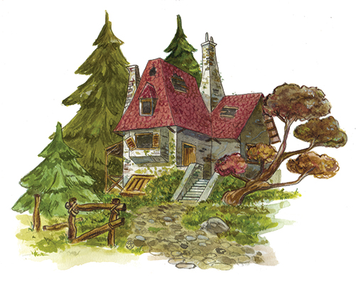

La struttura di un villaggio è abbastanza interessante da analizzare. Prima di tutto dobbiamo cancellare l’idea di villaggio che abbiamo nella nostra testa: in un villaggio di gnomi non ci sono piazze, non ci sono strade, non ci sono negozi e…

## Le abitazioni degli Gnomi

Si, ci sono case, ma sono case davvero particolari! La sua area si può estendere per  svariati chilometri: due “concittadini”, infatti, potrebbero vivere ad una distanza molto elevata. Tale organizzazione è dovuta principalmente ad una questione di sicurezza. Gli gnomi preferiscono infatti abitare separati uno dall’altro, per non destare inopportune attenzioni di curiosi. In tempi remoti, quando occupavano abitazioni poco distanti l’una dall’altra, è capitato che, qualche umano troppo curioso, si sia avvicinato così tanto da mettere in pericolo la vita di un’intera generazione…

Fortunatamente, le cronache popolari degli umani, riportano queste testimonianze come il racconto di qualcuno che aveva alzato un po’ troppo il gomito.

### Gli Gnomi e gli umani

Da questa, e da altre simili esperienze, hanno capito che è meglio non rischiare: gli uomini possono essere i loro migliori amici così come diventare, inaspettatamente, i loro nemici più spietati. Un re degli gnomi dell’area silvestre ebbe quindi l’idea di sfruttare gli elementi naturali per ottenere case confortevoli e funzionali allo scopo di mimetizzarsi e nascondersi all’occhio umano.

Una tipica casa di gnomo poteva quindi essere inglobata in un albero o, addirittura, nel più remoto pertugio di una caverna. Questo modello urbanistico si diffuse rapidamente, fino a diventare una prerogativa per la cultura gnomica.

